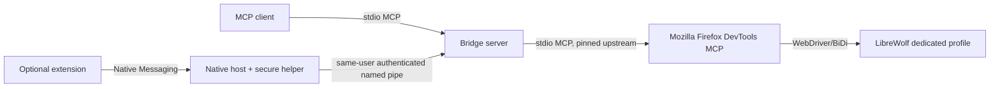

# Architecture

LibreWolf Agent Bridge is a local wrapper around Mozilla's pinned `@mozilla/firefox-devtools-mcp@0.9.15`. It starts that upstream MCP server as a stdio child rather than importing undocumented Mozilla internals. The boundary keeps upstream replaceable and lets this project own discovery, dedicated-profile lifecycle, stable bridge UIDs, bounded output, redaction, batching, and diagnostics.

## Controlled mode

Controlled mode is the intended product path. The bridge locates LibreWolf, acquires an app-owned profile lease, and asks Mozilla's process to create or reuse a nested `firefox_devtools_mcp_profile`. This isolation avoids attaching to the user's normal tabs, cookies, saved credentials, or session state. The public bridge restricts Mozilla to the `pages,snapshot,input,network,console,screenshot,downloads,utilities,script` modules and maps those upstream calls to its smaller `browser_*` interface. Script access is never exposed as a general-purpose public tool; the adapter uses only fixed, bounded functions for narrow fallbacks and safety probes.

On Windows, the native helper starts Mozilla's Node process suspended, assigns
it to a private Job Object with `JOB_OBJECT_LIMIT_KILL_ON_JOB_CLOSE`, and only
then lets it run. GeckoDriver and LibreWolf inherit that kernel-owned process
boundary. Shutdown still gives the upstream adapter a bounded graceful-close
window, but closing the supervisor's job is authoritative: descendants are
removed even if Mozilla's Node process exits before its own asynchronous
browser cleanup finishes. The exact-PID tree termination path remains a
secondary fallback. Other platforms use bounded graceful stdio shutdown.

LibreWolf `146.0-2` passed the recorded compatibility run, with known upstream constraints documented in [COMPATIBILITY.md](../COMPATIBILITY.md). This is evidence for that tested version, not a compatibility promise for every LibreWolf release.

## Companion mode

The extension routes explicit, origin-scoped user approvals through native messaging. On Windows, the packaged native host validates a short-lived discovery record, uses `secure-pipe-helper.exe` to enforce a current-user-only named-pipe DACL and peer checks, then authenticates a handshake before relaying messages. The Windows package installer copies the helper and host together, so a `browser_status` capability report—not the extension's mere presence—is the final availability check.

Native-messaging registration templates also exist for Linux and macOS, but the supplied hardened existing-session transport is Windows-only. Flatpak LibreWolf adds a separate sandbox boundary and is not supported for host-side registration by these templates. Use controlled mode on those platforms.

## Trust boundaries

- Web page content is untrusted input. It never grants permissions or changes MCP/client policy.
- The MCP client is responsible for user confirmation. The server marks destructive and sensitive operations in tool metadata.
- The upstream Mozilla child is constrained to the selected tool modules and a dedicated profile.
- Output is bounded and sensitive request/header/body fields are redacted before bridge results or logs leave the adapter.
- The optional extension requires browser-granted host permissions; a page cannot grant them.

See [SECURITY.md](SECURITY.md) for operational guidance and [PROTOCOL.md](PROTOCOL.md) for message contracts.
